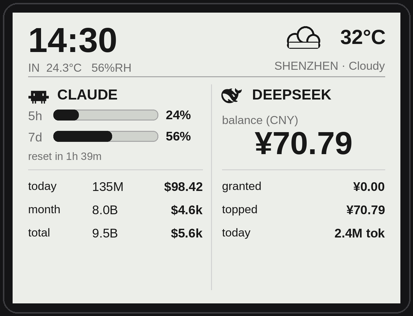

# ESP32-S3-RLCD-Monitor

[English](README.en.md)

把你的 DeepSeek 实时用量显示在 Waveshare ESP32-S3-RLCD-4.2 反射式 LCD 上的桌面摆件。



## 实现逻辑

```
~/.claude/**/*.jsonl   （Claude Code 会话日志，本地写入）
         │
         ▼
   bridge 守护进程                            ESP32-S3-RLCD-4.2
   ──────────────                            ─────────────────
   • 调用 ccusage 解析会话日志               • 开机连接 Wi-Fi
   • 从 Anthropic API 响应头获取             • 每 60 秒 GET /api/usage
     真实的 5h/7d 窗口用量                   • 用 cJSON 解析 JSON
   • 获取 DeepSeek 账户余额                  • LVGL 双栏 UI：
   • 获取室外天气（open-meteo，免 key）          左栏 → Claude 用量 + 进度条
   • 缓存结果，在 :7777 提供 JSON 服务          右栏 → DeepSeek 余额
                                             • 读取室内温湿度（SHTC3）
                                             • NTP 对时（CST-8）显示时间
```

bridge 以 systemd `--user` 服务形式运行在与 Claude Code 同一台机器上。后台线程每 45 秒刷新一次 ccusage，使 ESP32 的 HTTP 请求始终从缓存秒返（ccusage 冷启动约需 10 秒）。真实的 5h/7d 用量由另一个 root systemd timer 每 3 分钟探测一次 Anthropic API，将结果写入共享 JSON 文件，bridge 读取该文件。

```
14:30                            ☁  24°C
IN 26.3°C  65%RH         SHENZHEN  Partly
──────────────────────────────────────────
 CLAUDE           │  DEEPSEEK
 5h [████░░] 62%  │
 7d [████░░] 41%  │      balance
 reset in 2h14m   │    ¥ 70.79
 ─────────────────│──────────────────────
 today   162k  $4.21│ granted      0.00
 month   8.4M   $187│ topped      70.79
 total  18.2M   $214│ today    2.4M tok
```

## 硬件

- [Waveshare ESP32-S3-RLCD-4.2](https://www.waveshare.com/wiki/ESP32-S3-RLCD-4.2) — 4.2 英寸反射式 LCD（类纸面），ESP32-S3，Wi-Fi，RTC，温湿度，SD，音频。
  - 国内购买：[天猫链接](https://detail.tmall.com/item.htm?id=1010403328696)
- USB-C 数据线（用于烧录）。

## 架构

```
Linux / macOS 主机                        ESP32-S3-RLCD-4.2
──────────────                            ─────────────────
~/.claude/**/*.jsonl                      LVGL 终端 UI
        │                                         ▲
        ▼                    局域网 HTTP           │
   bridge 守护进程 ── GET /api/usage (60s) ───────┘
   （调用 ccusage）
   :7777
```

- **Bridge**（`bridge/`）— Python FastAPI 守护进程。调用 `ccusage blocks/daily/monthly --json`，汇总成统一 schema，在 `http://<主机>:7777/api/usage` 提供服务。以 systemd `--user` 方式运行。
- **固件**（`firmware/`）— ESP-IDF + LVGL v9 项目。每 60 秒轮询 bridge，在 RLCD 上渲染双栏仪表盘。

---

## 部署步骤

### 第一步 — 安装前置依赖

在运行 Claude Code 的机器上（Linux）：

```bash
# 1. uv（Python 包管理器）
curl -LsSf https://astral.sh/uv/install.sh | sh

# 2. Node + npx（ccusage 是 npm 包）
# Ubuntu/Debian：
sudo apt install nodejs npm
# 或使用 nvm：https://github.com/nvm-sh/nvm

# 3. 验证 ccusage 可用
npx -y ccusage@latest --help
```

### 第二步 — 克隆并本地测试 bridge

```bash
git clone https://github.com/CEJXXX/token-monitor-RLCD.git
cd token-monitor-RLCD/bridge

uv sync                            # 安装 Python 依赖（首次）
uv run python bridge.py            # 监听 :7777
```

新开一个终端验证：

```bash
curl http://localhost:7777/api/usage | jq          # 实时数据
curl 'http://localhost:7777/api/usage?mock=1' | jq # 模拟数据（不依赖 ccusage）
```

### 第三步 — 安装为 systemd 服务

```bash
# 在仓库根目录执行：
scripts/install-bridge-linux.sh
```

脚本会自动创建 `~/.config/systemd/user/rlcd-bridge.service` 并启动服务。

```bash
systemctl --user status rlcd-bridge
journalctl --user -u rlcd-bridge -f
```

如果需要退出登录后继续运行（VPS / 无头服务器）：

```bash
loginctl enable-linger $USER
```

#### 可选环境变量

创建 `bridge/.env`（已在 .gitignore 中）并按需填写：

```ini
RLCD_HOST=0.0.0.0          # 监听地址（默认 0.0.0.0）
RLCD_PORT=7777              # 监听端口（默认 7777）
RLCD_AUTH_TOKEN=<随机串>    # 非本地访问时必须设置
RLCD_WEATHER_LAT=22.5431   # 纬度（默认深圳）
RLCD_WEATHER_LON=114.0579  # 经度
RLCD_WEATHER_CITY=SHENZHEN # 设备上显示的城市名（≤8 个字符）
# 天气源（二选一，优先 Caiyun；不设则自动用 open-meteo，无需 key）
CAIYUN_API_KEY=<彩云天气token>   # 推荐，国内准确度更高；申请：https://dashboard.caiyunapp.com（默认每天刷新 1 次，总额度 10000 次）
# QWEATHER_KEY=<和风天气key>     # 备选（需自行适配 sources/weather.py）
DEEPSEEK_API_KEY=sk-...    # 启用 DeepSeek 余额显示（可选）
RLCD_WEEKLY_LIMIT_USD=100  # 你的周预算，设置后启用周进度条
RLCD_BLOCK_LIMIT_USD=20    # 你的 5h 窗口预算，设置后启用 5h 进度条
```

修改后重启服务：

```bash
systemctl --user restart rlcd-bridge
```

**只要 bridge 不是只监听 loopback，就必须设置 `RLCD_AUTH_TOKEN`。** 生成随机 token：

```bash
openssl rand -hex 32
```

### 第四步 — 获取真实 5h/7d 用量（可选，需要 root）

Claude Code `/usage` 显示的窗口用量来自 `anthropic-ratelimit-unified-*` 响应头。需要 root 权限读取 `/root/.claude/.credentials.json` 中的 OAuth token，再调用 Anthropic API 并写入 `/run/rlcd/claude-limits.json`。一个 root systemd timer 每 3 分钟运行一次：

```bash
sudo install -m 0755 scripts/rlcd-claude-limits.py /usr/local/sbin/rlcd-claude-limits.py
sudo cp scripts/rlcd-claude-limits.service scripts/rlcd-claude-limits.timer \
       /etc/systemd/system/
sudo systemctl enable --now rlcd-claude-limits.timer
sudo systemctl status rlcd-claude-limits.timer
```

每次运行消耗一条 1-token Haiku 消息（费用极低）。若 OAuth token 失效，`limits.status` 变为 `stale`，设备继续显示上次有效数据。

> Anthropic 不通过 API 公开 Pro/Max 套餐的 token 或金额上限。若要启用进度条，需手动设置 `RLCD_WEEKLY_LIMIT_USD` / `RLCD_BLOCK_LIMIT_USD`。

### 第五步 — 编译并烧录固件

#### 前置工具

- [ESP-IDF v5.x](https://docs.espressif.com/projects/esp-idf/en/stable/esp32s3/get-started/)
- Windows：从 <https://dl.espressif.com/dl/esp-idf/> 下载 **Universal Online Installer**（选最新 v5.x，目标芯片选 `esp32s3`）。

#### Linux / macOS

```bash
cd firmware
cp main/secrets.h.example main/secrets.h
$EDITOR main/secrets.h    # 填入 Wi-Fi SSID/密码、bridge 地址、token

idf.py set-target esp32s3
idf.py build flash monitor    # Ctrl+] 退出串口监视器
```

#### Windows（通过开始菜单 ESP-IDF PowerShell 快捷方式）

```powershell
cd C:\path\to\token-monitor-RLCD\firmware
copy main\secrets.h.example main\secrets.h
notepad main\secrets.h    # 填入 Wi-Fi / bridge 地址 / token
idf.py set-target esp32s3
idf.py build flash monitor
```

#### `secrets.h` 各项说明

| 字段 | 示例 | 说明 |
|------|------|------|
| `RLCD_WIFI_SSID` | `"MyNetwork"` | 仅支持 2.4 GHz（ESP32 不支持 5 GHz） |
| `RLCD_WIFI_PASSWORD` | `"password"` | WPA2 |
| `RLCD_BRIDGE_URL` | `"http://192.168.1.42:7777/api/usage"` | bridge 地址，见下方部署模式 |
| `RLCD_BRIDGE_TOKEN` | `""` | 与 `RLCD_AUTH_TOKEN` 保持一致，未设置则留空 |
| `RLCD_POLL_SEC` | `60` | 轮询间隔（秒） |

首次编译会通过 IDF 组件管理器下载 `lvgl/lvgl@^9.4.0`（约 50 MB），需要联网。

### 第六步 — 验证

1. 串口监视器打印 `connecting to <ssid>...` → `got IP ...`，随后仪表盘填充数据。
2. 建议先用 mock 模式：将 `RLCD_BRIDGE_URL` 改为 `.../api/usage?mock=1` 烧录，确认 UI 正常渲染。
3. 切换回实时模式，跑一分钟 Claude Code，等下次轮询后观察 `active_block.tokens_used` 增长。
4. 停止 bridge 服务：UI 应显示 `(stale)` 但不崩溃，保持上次数据。

---

## 部署模式

### 模式 A — 同局域网（最简单）

bridge 和 ESP32 在同一个家庭/办公室网络中。

```ini
# bridge/.env
RLCD_HOST=0.0.0.0
RLCD_AUTH_TOKEN=<随机32字节>
```

```c
// secrets.h
#define RLCD_BRIDGE_URL   "http://192.168.1.42:7777/api/usage"
#define RLCD_BRIDGE_TOKEN "<相同token>"
```

### 模式 B — 公网直连（bridge 在 VPS 上）

将 bridge 直接暴露在 VPS 的公网 IP 上，ESP32 通过公网连接。由于流量经过公网，强 token 和防火墙规则必不可少。

```ini
# VPS 上的 bridge/.env
RLCD_HOST=0.0.0.0
RLCD_AUTH_TOKEN=<随机32字节>
```

```c
// secrets.h
#define RLCD_BRIDGE_URL   "http://203.0.113.10:7777/api/usage"
#define RLCD_BRIDGE_TOKEN "<相同token>"
```

防火墙：仅在需要时开放 7777 端口，或限制来源 IP 为家庭宽带的 IP 段。

#### 进阶：用反向代理套 HTTPS（nginx）

更安全的方案是在 nginx 后面运行 bridge，配合 Let's Encrypt 证书做 TLS 终止。这样无需开放 7777 端口，统一走 443。

```nginx
# /etc/nginx/sites-available/rlcd
server {
    listen 443 ssl;
    server_name rlcd.example.com;

    ssl_certificate     /etc/letsencrypt/live/rlcd.example.com/fullchain.pem;
    ssl_certificate_key /etc/letsencrypt/live/rlcd.example.com/privkey.pem;

    location /api/usage {
        proxy_pass http://127.0.0.1:7777;
        proxy_set_header X-RLCD-Token $http_x_rlcd_token;
    }
    location /healthz {
        proxy_pass http://127.0.0.1:7777;
    }
}
```

```c
// secrets.h — 注意 https://
#define RLCD_BRIDGE_URL   "https://rlcd.example.com/api/usage"
```

> ESP32 HTTP 客户端支持 HTTPS，但需要将服务器 CA 证书内嵌到固件中。使用 Let's Encrypt 证书时，将 ISRG Root X1 的 PEM 内嵌到 `usage_client.c` 并通过 `esp_http_client_config_t.cert_pem` 传入。

### 模式 C — overlay 网络（ZeroTier / Tailscale）

ESP32 需要能访问与 bridge 相同的 overlay 网络——通常通过家用路由器或常开设备（树莓派、NAS）接入 overlay 并路由流量到家庭局域网。

```c
// secrets.h — Tailscale
#define RLCD_BRIDGE_URL   "http://100.x.x.x:7777/api/usage"

// secrets.h — ZeroTier
#define RLCD_BRIDGE_URL   "http://10.x.x.x:7777/api/usage"
```

#### ZeroTier MTU 问题

若 TCP 握手成功但响应始终收不到，原因是 ZeroTier 默认 MTU 2800 字节大于实际路径 MTU（约 1400 字节）。在 VPS 上修复：

```bash
# 先查你的 ZeroTier 接口名：
ip link show | grep zt

sudo scripts/vps-zt-mtu-fix.sh <zt-接口名>
sudo cp scripts/rlcd-zt-fix.service /etc/systemd/system/
sudo systemctl enable --now rlcd-zt-fix.service   # 开机自动生效
```

最简洁的方案是在 ZeroTier Central 把网络 MTU 设为 1400，所有成员自动生效。

---

## 项目结构

```
token-monitor-RLCD/
├── bridge/                    # Python FastAPI bridge 守护进程
│   ├── bridge.py              # 主程序 + 后台刷新缓存
│   ├── schema.py              # Pydantic 响应模型
│   ├── sources/
│   │   ├── claude_local.py    # ccusage 集成
│   │   ├── claude_limits.py   # 读取 /run/rlcd/claude-limits.json
│   │   ├── deepseek.py        # DeepSeek 余额 API
│   │   └── weather.py         # open-meteo（免 API key）
│   └── pyproject.toml
├── firmware/                  # ESP-IDF v5 + LVGL v9 项目
│   ├── main/
│   │   ├── secrets.h.example  # → 复制为 secrets.h（已 gitignore）
│   │   └── user_config.h      # 引脚定义（来自厂商 BSP）
│   └── components/
│       ├── net_app/           # Wi-Fi STA + NTP（CST-8）
│       ├── sensor/            # SHTC3 温湿度驱动
│       ├── usage_client/      # HTTP 轮询 + cJSON 解析
│       └── ui_app/            # LVGL 双栏仪表盘 + 图标
├── scripts/
│   ├── install-bridge-linux.sh           # systemd --user 安装脚本
│   ├── rlcd-claude-limits.py             # root 定时器：获取并写入限额 JSON
│   ├── rlcd-claude-limits.{service,timer}
│   └── vps-zt-mtu-fix.sh                 # ZeroTier MTU/MSS 修复
└── docs/
    └── mockup.png             # UI 参考原型图
```

## 许可证

MIT
