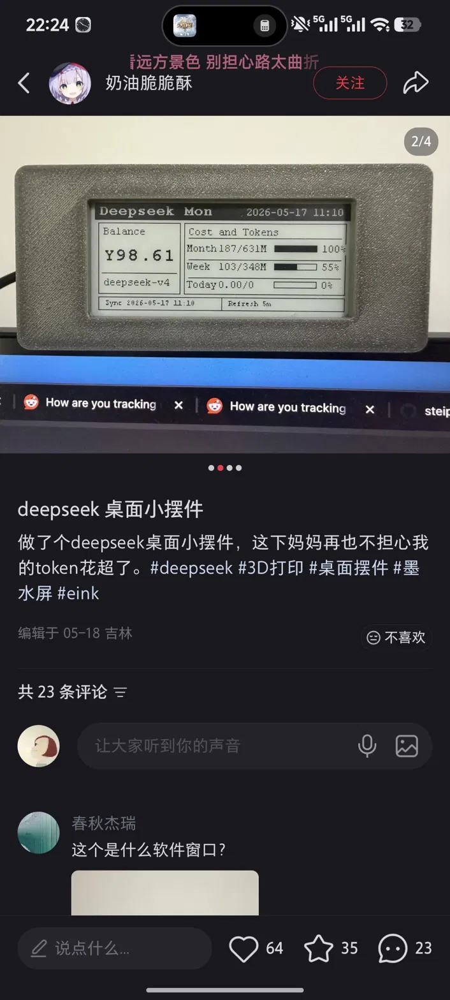

# token-monitor-RLCD

[中文文档](README.zh.md)

A desktop ornament that shows your live Claude (Pro/Max + API) and DeepSeek usage on a Waveshare ESP32-S3-RLCD-4.2 reflective-LCD board.



## How it works

```
~/.claude/**/*.jsonl   (Claude Code session logs, written locally)
         │
         ▼
   bridge daemon                              ESP32-S3-RLCD-4.2
   ─────────────                              ─────────────────
   • runs ccusage to parse session logs       • connects to WiFi on boot
   • fetches real 5h/7d window limits         • polls GET /api/usage every 60 s
     from Anthropic API headers               • parses JSON with cJSON
   • fetches DeepSeek account balance         • drives LVGL two-column UI:
   • fetches outdoor weather (open-meteo)       left  → Claude stats + bars
   • caches result, serves JSON on :7777        right → DeepSeek balance
                                              • reads indoor temp/RH (SHTC3)
                                              • shows time via NTP (CST-8)
```

The bridge runs as a systemd `--user` service on the same machine as Claude
Code. It keeps a background thread that refreshes ccusage every 45 s so the
ESP32's HTTP request always returns instantly from cache (a cold ccusage run
takes ~10 s). Real-time 5h/7d utilization comes from a separate root systemd
timer that probes the Anthropic API every 3 min and writes the result to a
shared JSON file the bridge reads.

```
14:30                            ☁  24°C
IN 26.3°C  65%RH         SHENZHEN  Partly
──────────────────────────────────────────
 CLAUDE           │  DEEPSEEK
 5h [████░░] 62%  │
 7d [████░░] 41%  │      balance
 reset in 2h14m   │    ¥ 70.79
 ─────────────────│──────────────────────
 today   162k  $4.21│ granted      0.00
 month   8.4M   $187│ topped      70.79
 total  18.2M   $214│ today    2.4M tok
```

## Hardware

- [Waveshare ESP32-S3-RLCD-4.2](https://www.waveshare.com/wiki/ESP32-S3-RLCD-4.2) — 4.2" reflective LCD (paper-like), ESP32-S3, WiFi, RTC, temp/humidity, SD, audio.
- USB-C cable for flashing.

## Architecture

```
Linux / macOS PC                          ESP32-S3-RLCD-4.2
────────────────                          ─────────────────
~/.claude/**/*.jsonl                      LVGL terminal UI
        │                                         ▲
        ▼                      LAN HTTP           │
   bridge daemon ──── GET /api/usage (60s) ──────┘
   (spawns ccusage)
   :7777
```

- **Bridge** (`bridge/`) — Python FastAPI daemon. Spawns `ccusage blocks/daily/monthly --json`, flattens into one schema, serves at `http://<host>:7777/api/usage`. Runs under systemd `--user`.
- **Firmware** (`firmware/`) — ESP-IDF + LVGL v9. Polls the bridge every 60 s, renders a two-column dashboard on the RLCD.

---

## Deployment

### Step 1 — Prerequisites

On the machine where Claude Code runs (Linux):

```bash
# 1. uv (Python package manager)
curl -LsSf https://astral.sh/uv/install.sh | sh

# 2. Node + npx  (ccusage is an npm package)
# Ubuntu/Debian:
sudo apt install nodejs npm
# or use nvm: https://github.com/nvm-sh/nvm

# 3. Verify ccusage works
npx -y ccusage@latest --help
```

### Step 2 — Clone and test the bridge

```bash
git clone https://github.com/CEJXXX/token-monitor-RLCD.git
cd token-monitor-RLCD/bridge

uv sync                            # install Python deps (first time only)
uv run python bridge.py            # starts on :7777
```

In another terminal:

```bash
curl http://localhost:7777/api/usage | jq          # live data
curl 'http://localhost:7777/api/usage?mock=1' | jq # canned mock — no ccusage needed
```

### Step 3 — Install the bridge as a systemd service

```bash
# From repo root:
scripts/install-bridge-linux.sh
```

This creates `~/.config/systemd/user/rlcd-bridge.service`, enables it, and starts it.

```bash
systemctl --user status rlcd-bridge
journalctl --user -u rlcd-bridge -f
```

To keep it running after logout (VPS / headless server):

```bash
loginctl enable-linger $USER
```

#### Optional env vars

Create `bridge/.env` (git-ignored) with any of these:

```ini
RLCD_HOST=0.0.0.0          # bind address (default 0.0.0.0)
RLCD_PORT=7777              # bind port    (default 7777)
RLCD_AUTH_TOKEN=<random>   # required when bridge is reachable beyond loopback
RLCD_WEATHER_LAT=22.5431   # your latitude  (default: Shenzhen)
RLCD_WEATHER_LON=114.0579  # your longitude
RLCD_WEATHER_CITY=MYTOWN   # city label on device (≤8 chars)
DEEPSEEK_API_KEY=sk-...    # enables DeepSeek balance display (optional)
RLCD_WEEKLY_LIMIT_USD=100  # your weekly budget — enables the weekly % bar
RLCD_BLOCK_LIMIT_USD=20    # your 5h window budget — enables the 5h % bar
```

Reload after editing:

```bash
systemctl --user restart rlcd-bridge
```

**Always set `RLCD_AUTH_TOKEN`** when the bridge listens on anything beyond loopback. Generate one with:

```bash
openssl rand -hex 32
```

### Step 4 — Real 5h/7d utilization (optional, requires root)

The real window utilization shown by Claude Code's `/usage` command comes from
`anthropic-ratelimit-unified-*` response headers. A root systemd timer reads the
OAuth token from `/root/.claude/.credentials.json` and writes the values to
`/run/rlcd/claude-limits.json` every 3 minutes.

```bash
sudo install -m 0755 scripts/rlcd-claude-limits.py /usr/local/sbin/rlcd-claude-limits.py
sudo cp scripts/rlcd-claude-limits.service scripts/rlcd-claude-limits.timer \
       /etc/systemd/system/
sudo systemctl enable --now rlcd-claude-limits.timer
sudo systemctl status rlcd-claude-limits.timer
```

Each run costs one 1-token Haiku message (negligible). If the OAuth token
expires, `limits.status` becomes `stale` and the device keeps showing the last
good values.

> Anthropic does **not** publish plan limits via API. Set
> `RLCD_WEEKLY_LIMIT_USD` / `RLCD_BLOCK_LIMIT_USD` to enable the % bars.

### Step 5 — Build and flash the firmware

#### Prerequisites

- [ESP-IDF v5.x](https://docs.espressif.com/projects/esp-idf/en/stable/esp32s3/get-started/)
- Windows: download the **Universal Online Installer** from <https://dl.espressif.com/dl/esp-idf/> (pick latest v5.x, target `esp32s3`).

#### Linux / macOS

```bash
cd firmware
cp main/secrets.h.example main/secrets.h
$EDITOR main/secrets.h           # fill in WiFi SSID/pass + bridge URL + token

idf.py set-target esp32s3
idf.py build flash monitor       # Ctrl+] to exit monitor
```

#### Windows (PowerShell via ESP-IDF Start Menu shortcut)

```powershell
cd C:\path\to\token-monitor-RLCD\firmware
copy main\secrets.h.example main\secrets.h
notepad main\secrets.h           # fill in WiFi / bridge URL / token
idf.py set-target esp32s3
idf.py build flash monitor
```

#### `secrets.h` values

| Key | Example | Notes |
|-----|---------|-------|
| `RLCD_WIFI_SSID` | `"MyNetwork"` | 2.4 GHz only (ESP32 does not support 5 GHz) |
| `RLCD_WIFI_PASSWORD` | `"password"` | WPA2 |
| `RLCD_BRIDGE_URL` | `"http://192.168.1.42:7777/api/usage"` | bridge host address — see deployment modes below |
| `RLCD_BRIDGE_TOKEN` | `""` | match `RLCD_AUTH_TOKEN` if set, else leave empty |
| `RLCD_POLL_SEC` | `60` | poll interval in seconds |

The first build downloads `lvgl/lvgl@^9.4.0` via the IDF component manager (~50 MB) — needs internet.

### Step 6 — Verify

1. Serial monitor prints `connecting to <ssid>...` → `got IP ...`, then the dashboard fills.
2. Use mock mode first: set `RLCD_BRIDGE_URL` to `.../api/usage?mock=1`, flash, confirm the UI renders.
3. Switch to live mode, run Claude Code for a minute, watch `active_block.tokens_used` increase on the next poll.
4. Stop the bridge: UI should show `(stale)` but not crash.

---

## Deployment modes

### Mode A — Same LAN (simplest)

Bridge and ESP32 are on the same home/office network.

```ini
# bridge/.env
RLCD_HOST=0.0.0.0
RLCD_AUTH_TOKEN=<random-32-bytes>
```

```c
// secrets.h
#define RLCD_BRIDGE_URL   "http://192.168.1.42:7777/api/usage"
#define RLCD_BRIDGE_TOKEN "<same-token>"
```

### Mode B — Public internet (bridge on a VPS)

Expose the bridge directly on the VPS's public IP. The ESP32 connects over the
open internet, so a strong token and firewall rules are essential.

```ini
# bridge/.env on VPS
RLCD_HOST=0.0.0.0          # or bind to a specific public interface
RLCD_AUTH_TOKEN=<random-32-bytes>
```

```c
// secrets.h
#define RLCD_BRIDGE_URL   "http://203.0.113.10:7777/api/usage"
#define RLCD_BRIDGE_TOKEN "<same-token>"
```

Firewall: open port 7777 only while you need it, or restrict source IP to your
home ISP's address range.

#### Optional: HTTPS via reverse proxy (nginx)

For a more secure setup, put the bridge behind nginx with a TLS certificate
(e.g. from Let's Encrypt via Certbot). This removes the need to open port 7777
and lets you terminate TLS on port 443.

```nginx
# /etc/nginx/sites-available/rlcd
server {
    listen 443 ssl;
    server_name rlcd.example.com;

    ssl_certificate     /etc/letsencrypt/live/rlcd.example.com/fullchain.pem;
    ssl_certificate_key /etc/letsencrypt/live/rlcd.example.com/privkey.pem;

    location /api/usage {
        proxy_pass http://127.0.0.1:7777;
        proxy_set_header X-RLCD-Token $http_x_rlcd_token;
    }
    location /healthz {
        proxy_pass http://127.0.0.1:7777;
    }
}
```

```c
// secrets.h — note https://
#define RLCD_BRIDGE_URL   "https://rlcd.example.com/api/usage"
```

> The ESP32 HTTP client supports HTTPS but requires the server CA certificate
> embedded in the firmware. For a Let's Encrypt cert, embed the ISRG Root X1
> PEM in `usage_client.c` and pass it via `esp_http_client_config_t.cert_pem`.

### Mode C — Overlay network (ZeroTier / Tailscale)

The ESP32 must be reachable on the same overlay as the bridge — typically via a
home router or always-on device (Raspberry Pi, NAS) that joins the overlay and
routes traffic to the home LAN.

```c
// secrets.h — Tailscale
#define RLCD_BRIDGE_URL   "http://100.x.x.x:7777/api/usage"

// secrets.h — ZeroTier
#define RLCD_BRIDGE_URL   "http://10.x.x.x:7777/api/usage"
```

#### ZeroTier MTU fix

If the TCP handshake succeeds but responses never arrive, ZeroTier's default
2800-byte MTU is larger than the real path MTU (~1400 bytes). Fix on the VPS:

```bash
# Find your ZeroTier interface name first:
ip link show | grep zt

sudo scripts/vps-zt-mtu-fix.sh <zt-interface>
sudo cp scripts/rlcd-zt-fix.service /etc/systemd/system/
sudo systemctl enable --now rlcd-zt-fix.service   # persists across reboots
```

The cleanest alternative is to set the ZeroTier network MTU to 1400 in ZeroTier Central.

---

## Project layout

```
token-monitor-RLCD/
├── bridge/                    # Python FastAPI bridge daemon
│   ├── bridge.py              # main app + background refresh cache
│   ├── schema.py              # Pydantic response models
│   ├── sources/
│   │   ├── claude_local.py    # ccusage integration
│   │   ├── claude_limits.py   # reads /run/rlcd/claude-limits.json
│   │   ├── deepseek.py        # DeepSeek balance API
│   │   └── weather.py         # open-meteo (no API key needed)
│   └── pyproject.toml
├── firmware/                  # ESP-IDF v5 + LVGL v9 project
│   ├── main/
│   │   ├── secrets.h.example  # → copy to secrets.h (git-ignored)
│   │   └── user_config.h      # pin assignments (from vendor BSP)
│   └── components/
│       ├── net_app/           # WiFi STA + NTP (CST-8)
│       ├── sensor/            # SHTC3 temp/humidity
│       ├── usage_client/      # HTTP poll + cJSON parse
│       └── ui_app/            # LVGL two-column dashboard + icons
├── scripts/
│   ├── install-bridge-linux.sh          # systemd --user installer
│   ├── rlcd-claude-limits.py            # root timer: fetch + write limits JSON
│   ├── rlcd-claude-limits.{service,timer}
│   └── vps-zt-mtu-fix.sh                # ZeroTier MTU/MSS fix
└── docs/
    └── mockup.png             # UI reference mockup
```

## License

MIT
